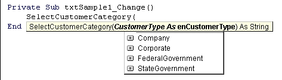

<div align="center">

## Create your own custom parameters list


</div>

### Description

Ever wonder how to create your own custom list of parameters for one of your functions? You know, like the MsgBox options list with items like vbQuestion, vbExclamation, etc? This article shows you how. It is easier than you might think.
 
### More Info
 


<span>             |<span>
---                |---
**Submitted On**   |2000-06-23 09:49:38
**By**             |[Matthew Roberts](https://github.com/Planet-Source-Code/PSCIndex/blob/master/ByAuthor/matthew-roberts.md)
**Level**          |Intermediate
**User Rating**    |4.9 (44 globes from 9 users)
**Compatibility**  |VB 5\.0, VB 6\.0
**Category**       |[Data Structures](https://github.com/Planet-Source-Code/PSCIndex/blob/master/ByCategory/data-structures__1-33.md)
**World**          |[Visual Basic](https://github.com/Planet-Source-Code/PSCIndex/blob/master/ByWorld/visual-basic.md)
**Archive File**   |[CODE\_UPLOAD70256232000\.zip](https://github.com/Planet-Source-Code/matthew-roberts-create-your-own-custom-parameters-list__1-9160/archive/master.zip)


### Source Code

```
<!doctype html public "-//w3c//dtd html 4.0 transitional//en">
<html>
<head>
  <meta name="Author" content="M@">
  <meta name="GENERATOR" content="Mozilla/4.75 [en] (Win98; U) [Netscape]">
</head>
<body>
<center><b><font face="Arial,Helvetica"><font size=-1>Creating Custom Option
Choices for Function Parameters</font></font></b>
<p><i><font face="Arial,Helvetica"><font size=-1>Note: A Microsoft Word
version of this article is available in .zip format below with full graphics
included. I recommend downloading it.</font></font></i></center>
<p><font face="Arial,Helvetica"><font size=-1>One of the things that I
love about Visual Basic 6 is the way it always tells you what it is expecting.
Where in most other languages, you are left guessing at the parameters
a function is expecting and what data type they should be, VB. shows you
the choices right where they are needed. For example, If I am calling the
function MsgBox to display a message box to the user, it looks like this
as I enter the code:</font></font>
<p><font face="Arial,Helvetica"><font size=-1>The usefulness of this feature
of the Visual Basic environment cannot be overstated. I often wished I
could create such option lists for my own functions. Instead of writing
a function like this:</font></font>
<p><font face="Arial,Helvetica"><font color="#000099"><font size=-1>Function
SelectCustomerCategory (CustomerType as Integer)&nbsp; As String</font></font></font>
<p><font face="Arial,Helvetica"><font color="#000099"><font size=-1>&nbsp;&nbsp;&nbsp;&nbsp;
Select Case CustomerType</font></font></font>
<p><font face="Arial,Helvetica"><font color="#000099"><font size=-1>&nbsp;&nbsp;&nbsp;&nbsp;&nbsp;&nbsp;&nbsp;&nbsp;
Case 0</font></font></font>
<br><font face="Arial,Helvetica"><font color="#000099"><font size=-1>&nbsp;&nbsp;&nbsp;&nbsp;&nbsp;&nbsp;&nbsp;&nbsp;&nbsp;&nbsp;&nbsp;&nbsp;&nbsp;
SelectCustomerCategory = &#8220;Corporate&#8221;</font></font></font>
<br><font face="Arial,Helvetica"><font color="#000099"><font size=-1>&nbsp;&nbsp;&nbsp;&nbsp;&nbsp;&nbsp;&nbsp;&nbsp;
Case 1</font></font></font>
<br><font face="Arial,Helvetica"><font color="#000099"><font size=-1>&nbsp;&nbsp;&nbsp;&nbsp;&nbsp;&nbsp;&nbsp;&nbsp;&nbsp;&nbsp;&nbsp;&nbsp;&nbsp;
SelectCustomerCategory = &#8220;Company&#8221;</font></font></font>
<br><font face="Arial,Helvetica"><font color="#000099"><font size=-1>&nbsp;&nbsp;&nbsp;&nbsp;&nbsp;&nbsp;&nbsp;&nbsp;
Case 2</font></font></font>
<br><font face="Arial,Helvetica"><font color="#000099"><font size=-1>&nbsp;&nbsp;&nbsp;&nbsp;&nbsp;&nbsp;&nbsp;&nbsp;&nbsp;&nbsp;&nbsp;&nbsp;&nbsp;
SelectCustomerCategory = &#8220;State Government&#8221;</font></font></font>
<br><font face="Arial,Helvetica"><font color="#000099"><font size=-1>&nbsp;&nbsp;&nbsp;&nbsp;&nbsp;&nbsp;&nbsp;&nbsp;
Case 3</font></font></font>
<br><font face="Arial,Helvetica"><font color="#000099"><font size=-1>&nbsp;&nbsp;&nbsp;&nbsp;&nbsp;&nbsp;&nbsp;&nbsp;&nbsp;&nbsp;&nbsp;&nbsp;&nbsp;
SelectCustomerCategory = &#8220;City Government&#8221;</font></font></font>
<br><font face="Arial,Helvetica"><font color="#000099"><font size=-1>&nbsp;&nbsp;&nbsp;&nbsp;&nbsp;&nbsp;&nbsp;&nbsp;
Case 4</font></font></font>
<br><font face="Arial,Helvetica"><font color="#000099"><font size=-1>&nbsp;&nbsp;&nbsp;&nbsp;&nbsp;&nbsp;&nbsp;&nbsp;&nbsp;&nbsp;&nbsp;&nbsp;&nbsp;
SelectCustomerCategory = &#8220;Federal Government&#8221;</font></font></font>
<br><font face="Arial,Helvetica"><font color="#000099"><font size=-1>&nbsp;&nbsp;&nbsp;&nbsp;
End Select</font></font></font>
<p><font face="Arial,Helvetica"><font color="#000099"><font size=-1>End
Function</font></font></font>
<p><font face="Arial,Helvetica"><font size=-1>I wanted to write it like
this:</font></font>
<p><font face="Arial,Helvetica"><font color="#000099"><font size=-1>Function
SelectCustomerCategory (CustomerType as Integer)&nbsp; As String</font></font></font>
<p><font face="Arial,Helvetica"><font color="#000099"><font size=-1>&nbsp;&nbsp;&nbsp;&nbsp;
Select Case CustomerType</font></font></font>
<p><font face="Arial,Helvetica"><font color="#000099"><font size=-1>&nbsp;&nbsp;&nbsp;&nbsp;&nbsp;&nbsp;&nbsp;&nbsp;
Case Corporate</font></font></font>
<br><font face="Arial,Helvetica"><font color="#000099"><font size=-1>&nbsp;&nbsp;&nbsp;&nbsp;&nbsp;&nbsp;&nbsp;&nbsp;&nbsp;&nbsp;&nbsp;&nbsp;&nbsp;
SelectCustomerCategory = &#8220;Corporate&#8221;</font></font></font>
<br><font face="Arial,Helvetica"><font color="#000099"><font size=-1>&nbsp;&nbsp;&nbsp;&nbsp;&nbsp;&nbsp;&nbsp;&nbsp;
Case Company</font></font></font>
<br><font face="Arial,Helvetica"><font color="#000099"><font size=-1>&nbsp;&nbsp;&nbsp;&nbsp;&nbsp;&nbsp;&nbsp;&nbsp;&nbsp;&nbsp;&nbsp;&nbsp;
SelectCustomerCategory = &#8220;Company&#8221;</font></font></font>
<br><font face="Arial,Helvetica"><font color="#000099"><font size=-1>&nbsp;&nbsp;&nbsp;&nbsp;&nbsp;&nbsp;&nbsp;&nbsp;
Case StateGovernment</font></font></font>
<br><font face="Arial,Helvetica"><font color="#000099"><font size=-1>&nbsp;&nbsp;&nbsp;&nbsp;&nbsp;&nbsp;&nbsp;&nbsp;&nbsp;&nbsp;&nbsp;&nbsp;&nbsp;
SelectCustomerCategory = &#8220;State Government&#8221;</font></font></font>
<br><font face="Arial,Helvetica"><font color="#000099"><font size=-1>&nbsp;&nbsp;&nbsp;&nbsp;&nbsp;&nbsp;&nbsp;&nbsp;
Case CityGovernment</font></font></font>
<br><font face="Arial,Helvetica"><font color="#000099"><font size=-1>&nbsp;&nbsp;&nbsp;&nbsp;&nbsp;&nbsp;&nbsp;&nbsp;&nbsp;&nbsp;&nbsp;&nbsp;&nbsp;
SelectCustomerCategory = &#8220;City Government&#8221;</font></font></font>
<br><font face="Arial,Helvetica"><font color="#000099"><font size=-1>&nbsp;&nbsp;&nbsp;&nbsp;&nbsp;&nbsp;&nbsp;&nbsp;
Case FederalGovernment</font></font></font>
<br><font face="Arial,Helvetica"><font color="#000099"><font size=-1>&nbsp;&nbsp;&nbsp;&nbsp;&nbsp;&nbsp;&nbsp;&nbsp;&nbsp;&nbsp;&nbsp;&nbsp;&nbsp;
SelectCustomerCategory = &#8220;Federal Government&#8221;</font></font></font>
<br><font face="Arial,Helvetica"><font color="#000099"><font size=-1>&nbsp;&nbsp;&nbsp;&nbsp;
End Select</font></font></font>
<p><font face="Arial,Helvetica"><font color="#000099"><font size=-1>End
Function</font></font></font>
<br>&nbsp;
<p><font face="Arial,Helvetica"><font size=-1>But in order to do this,
I found myself creating lots of constants like:</font></font>
<p><font face="Arial,Helvetica"><font color="#000099"><font size=-1>Const
Corporate = 0</font></font></font>
<br><font face="Arial,Helvetica"><font color="#000099"><font size=-1>Const
Company =1</font></font></font>
<br><font face="Arial,Helvetica"><font color="#000099"><font size=-1>Const
StateGovernment=2</font></font></font>
<br><font face="Arial,Helvetica"><font color="#000099"><font size=-1>Const
CityGovernment=3</font></font></font>
<br><font face="Arial,Helvetica"><font color="#000099"><font size=-1>Const
FederalGovernment =4</font></font></font>
<p><font face="Arial,Helvetica"><font size=-1>Although this worked, once
I had about 10 functions with five or six possible options, I started having
trouble remembering which constants were defined for which functions. They
would show up in the Options List if I pressed <font color="#006600">&lt;ctrl>
&lt;space></font>, but since they were in alphabetical order, &#8220;Corporate
&#8220;was miles away from the other constant &#8220;StateGovernment&#8221;.</font></font>
<p><font face="Arial,Helvetica"><font size=-1>Looking back, this all seems
so useless, but at the time, I was very pleased with myself. Then one day
I was reading a Visual Basics Standards book and discovered the &#8220;enum&#8221;
data type.&nbsp; I have used User Defined Types (see my article on it by
following the hyperlink) in QuickBasic and Visual Basic, so this seemed
vaguely familiar. After reading about enum, I was delighted. It was exactly
what I was looking for. With it you can define a set of parameters as a
single data type and then &#8220;alias&#8221; the values with more understandable names
(Like &#8220;Corporate&#8221; instead of &#8220;0&#8221;). When you select the parameter &#8220;Corporate&#8221;
from the drop-down list, the aliased value of &#8220;0&#8221; is passed to the function.
Sound cool? Read on and I will show you how do to it. It is actually very
easy.</font></font>
<p><font face="Arial,Helvetica"><font size=-1>First, you must define the
enum variable that will hold the values. In the declarations section of
your form or module, add the following code:</font></font>
<p><font face="Arial,Helvetica"><font color="#000099"><font size=-1>&nbsp;&nbsp;&nbsp;
Public Enum enCustomerType</font></font></font>
<br><font face="Arial,Helvetica"><font color="#000099"><font size=-1>&nbsp;&nbsp;&nbsp;&nbsp;&nbsp;&nbsp;&nbsp;&nbsp;
Corporate = 0</font></font></font>
<br><font face="Arial,Helvetica"><font color="#000099"><font size=-1>&nbsp;&nbsp;&nbsp;&nbsp;&nbsp;&nbsp;&nbsp;&nbsp;
Company = 1</font></font></font>
<br><font face="Arial,Helvetica"><font color="#000099"><font size=-1>&nbsp;&nbsp;&nbsp;&nbsp;&nbsp;&nbsp;&nbsp;&nbsp;
StateGovernment = 2</font></font></font>
<br><font face="Arial,Helvetica"><font color="#000099"><font size=-1>&nbsp;&nbsp;&nbsp;&nbsp;&nbsp;&nbsp;&nbsp;&nbsp;
CityGovernment = 4</font></font></font>
<br><font face="Arial,Helvetica"><font color="#000099"><font size=-1>&nbsp;&nbsp;&nbsp;&nbsp;&nbsp;&nbsp;&nbsp;&nbsp;
FederalGovernment = 5</font></font></font>
<br><font face="Arial,Helvetica"><font color="#000099"><font size=-1>&nbsp;&nbsp;&nbsp;
End Enum</font></font></font>
<p><font face="Arial,Helvetica"><font size=-1>There are some &#8220;rules&#8221; I
need to point out about the above code.</font></font>
<p><font face="Arial,Helvetica"><font size=-1>1. Of course, the name of
your variable must be unique for the scope you are working in.</font></font>
<br><font face="Arial,Helvetica"><font size=-1>2. The Enum data type<b>
can only accept Numerical values</b>. Strings are not allowed. Corporate
= &#8220;Corp&#8221; will not compile.</font></font>
<br><font face="Arial,Helvetica"><font size=-1>3. The list can be as long
as you like.</font></font>
<br><font face="Arial,Helvetica"><font size=-1>4. The values do not have
to be consecutive. They can be any numerical value.</font></font>
<p><font face="Arial,Helvetica"><font size=-1>Now for the function (This
is the fun part):</font></font>
<p><font face="Arial,Helvetica"><font size=-1>Instead of using:</font></font>
<p><font face="Arial,Helvetica"><font color="#000099"><font size=-1>&nbsp;&nbsp;&nbsp;
Function SelectCustomerCategory (CustomerType as Integer)&nbsp; As String</font></font></font>
<p><font face="Arial,Helvetica"><font size=-1>We are now going to use:</font></font>
<p><font face="Arial,Helvetica"><font color="#000099"><font size=-1>&nbsp;&nbsp;&nbsp;
Function SelectCustomerCategory (CustomerType as enCustomerType)&nbsp;
As String</font></font></font>
<p><font face="Arial,Helvetica"><font size=-1>So we are replacing the Integer
data type with the enum type we created.</font></font>
<p><font face="Arial,Helvetica"><font size=-1>Complete your function:</font></font>
<p><font face="Arial,Helvetica"><font size=-1>&nbsp;&nbsp;&nbsp; <font color="#000099">Function
SelectCustomerCategory (CustomerType as enCustomerType)&nbsp; As String</font></font></font>
<p><font face="Arial,Helvetica"><font size=-1>&nbsp;<font color="#000099">Select
Case CustomerType</font></font></font>
<p><font face="Arial,Helvetica"><font color="#000099"><font size=-1>&nbsp;Case
Corporate</font></font></font>
<br><font face="Arial,Helvetica"><font color="#000099"><font size=-1>&nbsp;&nbsp;&nbsp;&nbsp;&nbsp;
SelectCustomerCategory = &#8220;Corporate&#8221;</font></font></font>
<br><font face="Arial,Helvetica"><font color="#000099"><font size=-1>&nbsp;Case
Company</font></font></font>
<br><font face="Arial,Helvetica"><font color="#000099"><font size=-1>&nbsp;&nbsp;&nbsp;&nbsp;&nbsp;
SelectCustomerCategory = &#8220;Company&#8221;</font></font></font>
<br><font face="Arial,Helvetica"><font color="#000099"><font size=-1>&nbsp;Case
StateGovernment</font></font></font>
<br><font face="Arial,Helvetica"><font color="#000099"><font size=-1>&nbsp;&nbsp;&nbsp;&nbsp;&nbsp;
SelectCustomerCategory = &#8220;State Government&#8221;</font></font></font>
<br><font face="Arial,Helvetica"><font color="#000099"><font size=-1>&nbsp;Case
CityGovernment</font></font></font>
<br><font face="Arial,Helvetica"><font color="#000099"><font size=-1>&nbsp;&nbsp;&nbsp;&nbsp;&nbsp;
SelectCustomerCategory = &#8220;City Government&#8221;</font></font></font>
<br><font face="Arial,Helvetica"><font color="#000099"><font size=-1>&nbsp;Case
FederalGovernment</font></font></font>
<br><font face="Arial,Helvetica"><font color="#000099"><font size=-1>&nbsp;&nbsp;&nbsp;&nbsp;&nbsp;
SelectCustomerCategory = &#8220;Federal Government&#8221;</font></font></font>
<br><font face="Arial,Helvetica"><font color="#000099"><font size=-1>&nbsp;End
Select</font></font></font>
<p><font face="Arial,Helvetica"><font color="#000099"><font size=-1>End
Function</font></font></font>
<p><font face="Arial,Helvetica"><font size=-1>That is all there is to it!
Now try this:</font></font>
<br>&nbsp;
<p><font face="Arial,Helvetica"><font size=-1>Enter the following text
in a form or module:</font></font>
<p><font face="Arial,Helvetica"><font color="#000099"><font size=-1>SelectCustomerType
(</font></font></font>
<p><font face="Arial,Helvetica"><font size=-1>And watch what happens. You
should see a list of values appear like magic.</font></font>
<p><font face="Arial,Helvetica"><font size=-1>You can then select one of
you choices. When the function is called the value that you defined for
the enum item will be passed. For example, if you select Corporate, the
number 1 will be passed to the function.</font></font>
<br>&nbsp;
<br>&nbsp;
<br>
<br>
<center>
<p><font face="Arial,Helvetica">Have Fun!</font></center>
<p><br>
<br>
<br>
<br>
<br>
<br>
</body>
</html>
```

